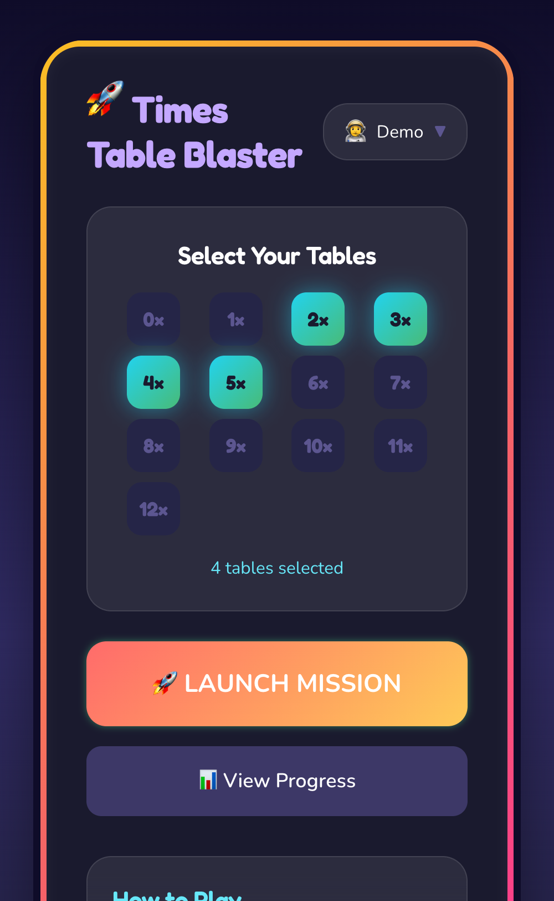
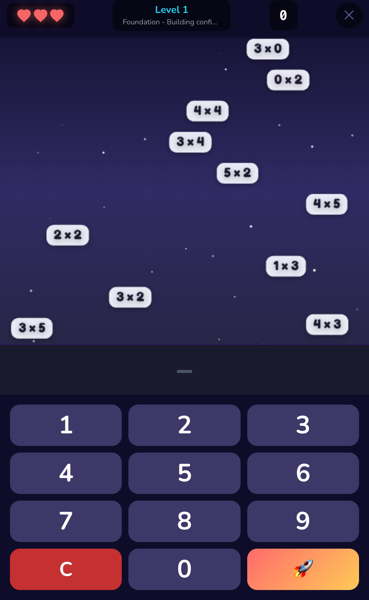

# Times Table Blaster

An arcade-style typing shooter game for learning multiplication tables. Type the correct answer to fire missiles at falling math problems before they reach the bottom!

## Screenshots

<p align="center">
  
  
  
</p>

## Features

- **Spaced Repetition Learning** - Uses SM-2 algorithm to prioritize problems you struggle with
- **Multiple Profiles** - Track progress for different players
- **Difficulty Progression** - Speed increases as you level up
- **Statistics Tracking** - View accuracy and performance per multiplication table
- **Visual Feedback** - Explosions for correct answers, emoji reactions for mistakes

## Getting Started

```bash
# Install dependencies
bun install

# Start development server
bun dev

# Build for production
bun run build

# Preview production build
bun run preview
```

## How to Play

1. Create or select a profile
2. Choose which multiplication tables to practice (2-12)
3. Type the answer to falling problems and press Enter to fire
4. Correct answers launch missiles that destroy the problem
5. Wrong answers show feedback but don't fire
6. Game ends when 3 problems reach the bottom

## Tech Stack

- React 19 + TypeScript
- Vite
- Tailwind CSS v4
- IndexedDB (via idb) for local persistence
